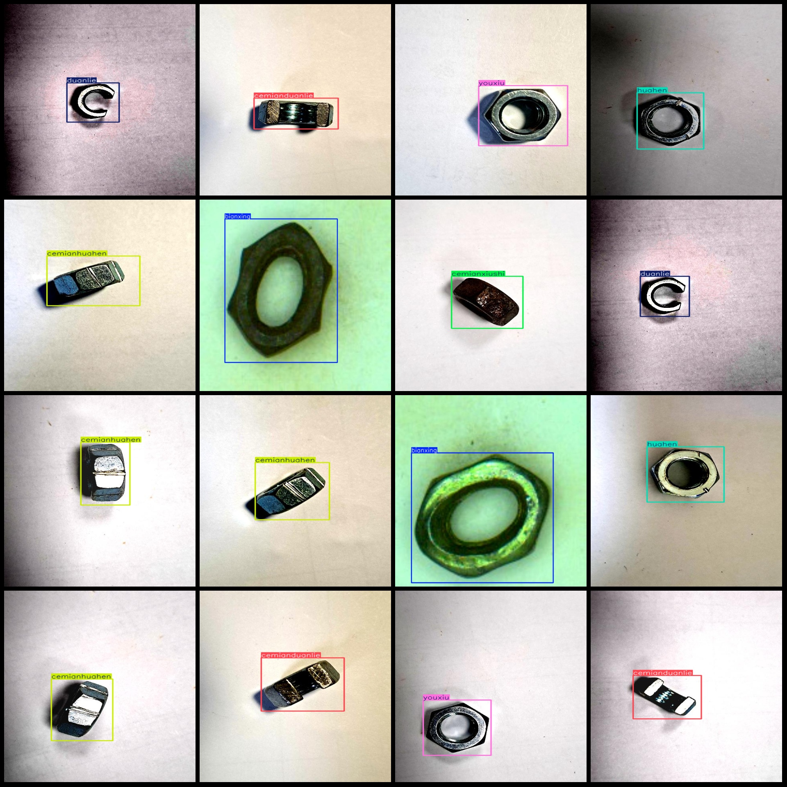

# 5245 images of 52 categories for defect detection using YOLOv3+VOC dataset in VOC+YOLO format

Note: There are some enhanced images in the dataset.

Dataset format: Pascal VOC format and YOLO format (excluding segmentation path's txt file, only containing jpg images and corresponding VOC format xml file and yolo format txt file)

Total number of images (jpg files): 5245
Number of annotations (xml files): 5245
Number of annotations (txt files): 5245
Number of annotation categories: 9
Annotation category names (as per classes.txt in the labels folder): ["deformation", "excellent", "fracture", "rust", "scratch", "side-excellent", "side-fracture", "side-rust", "side-scratch"]

["Deformation", "Outstanding", "Breakage", "Rust", "Scratch", "Side Outstanding", "Side Breakage", "Side Rust", "Side Scratch"]

The number of boxes labeled for each category:
- Bianxing boxes = 725
- Cemianduanlie boxes = 565
- Cemianhuahen boxes = 565
- Cemanxiushi boxes = 565
- Cemianyouxiu boxes = 565
- Duanlie boxes = 565
- Huahen boxes = 565
- Xiushi boxes = 565
- Youxiu boxes = 565

The total number of frames is 5245.

images per class: 
- bianxing images = 725
- cemianduanlie images = 565
- cemianhuahen images = 565
- cemianxiushi images = 565
- cemianyouxiu images = 565
- duanlie images = 565
- huahen images = 565
- xiushi images = 565
- youxiu images = 565

Image resolution: 480x640

Use annotation tool: labelImg

Annotation rule: Draw a rectangle around the class.

Important notes: The dataset is not divided into training, validation, and test sets. You need to divide it yourself.

Special Disclaimer: This dataset does not guarantee the accuracy of the trained model or the weight files.
Image

Here is a pay link on Stripe ( https://buy.stripe.com/3cs8yP7sY87d0vu9AB ). Please contact me lonlonago@foxmail.com after funding $89, and I will send you a complete data files , thank you!

